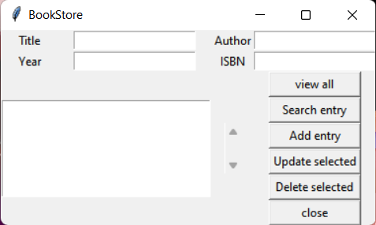

# BookStore Application

The goal of this project is to create a Book Store Application by using **Tkinter**



### Main features

* Used to maintain database of books present in bookstore.

* user can make update's to current database by selecting data , modify and Update


## Folder directory of the Project
```              
📦BookStoreApplication
 ┣ 📂Readme_files
 ┃ ┗ 📜bookapp.png
 ┣ 📂__pycache__
 ┃ ┗ 📜backend.cpython-39.pyc
 ┣ 📜.gitignore
 ┣ 📜backend.py
 ┣ 📜book.db
 ┣ 📜frontend.py
 ┣ 📜LICENSE
 ┗ 📜Readme.md
```
Note:- Some of  file are only visible after  runing the development
           


## Version(**Used while making project**) 

Python:
     
     Python 3.9.9

PIP :
   
     pip 21.2.4     
     
Tkinter:
     
     Tkinter 8.6.12
     
## Install project dependencies:(**Ignore if you have following dependencies in you computer**)

Python:
     
     https://www.python.org/

PIP :
   
     python get-pip.py     
     
Tkinter:
     
     pip install tk
     
 
# Book Store Application

## Getting Started

First clone the repository from Github and switch to the new directory:

     git clone https://github.com/sa24449/BookStore_Application.git
     

Move to Project directory:

     cd BookStore_Application
    

You can now run the development :

     python frontend.py 
     

